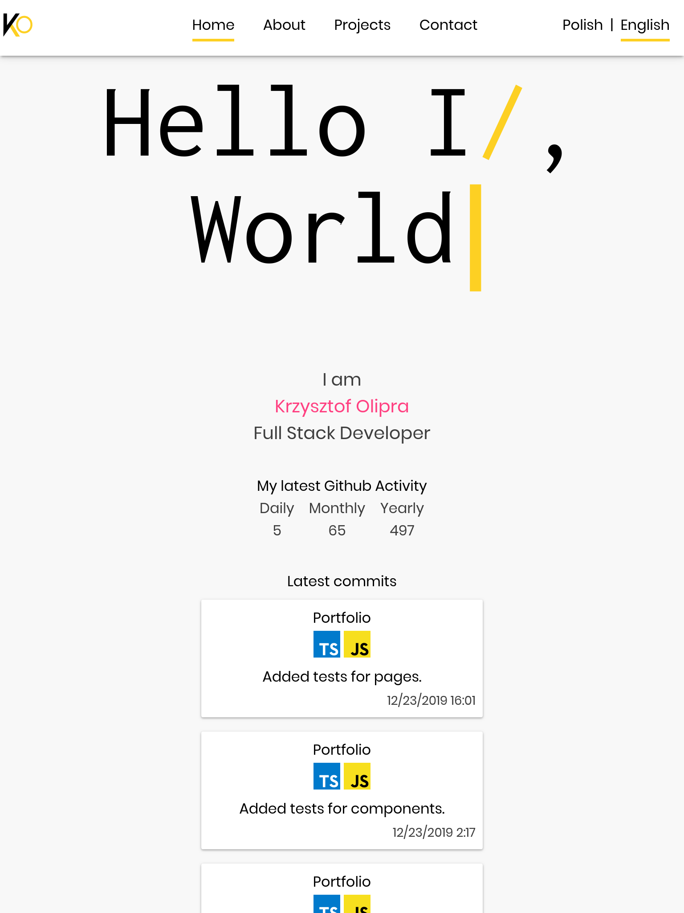
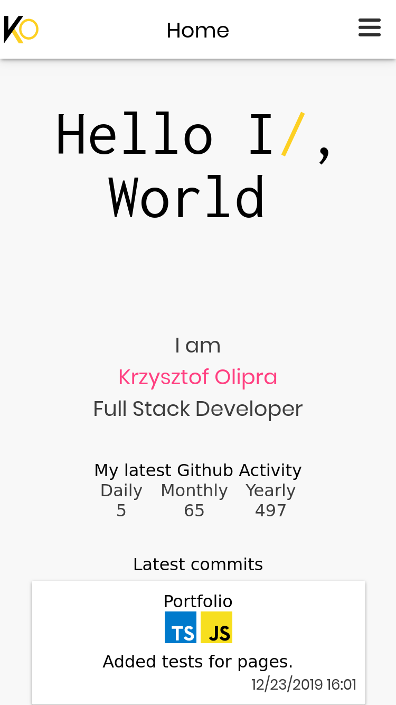
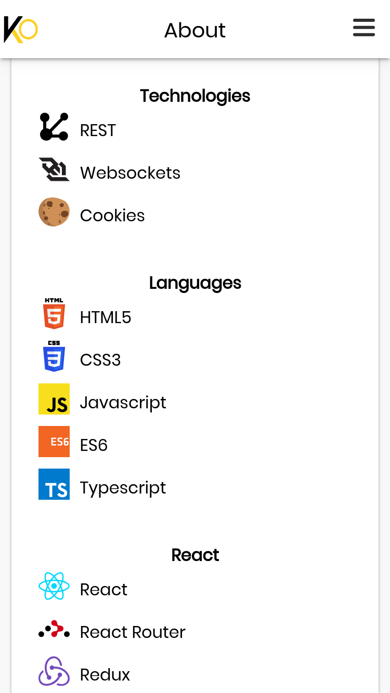
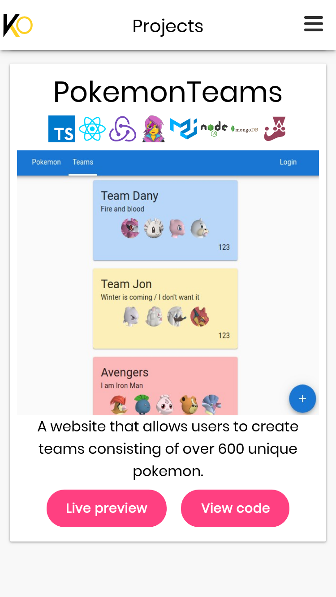
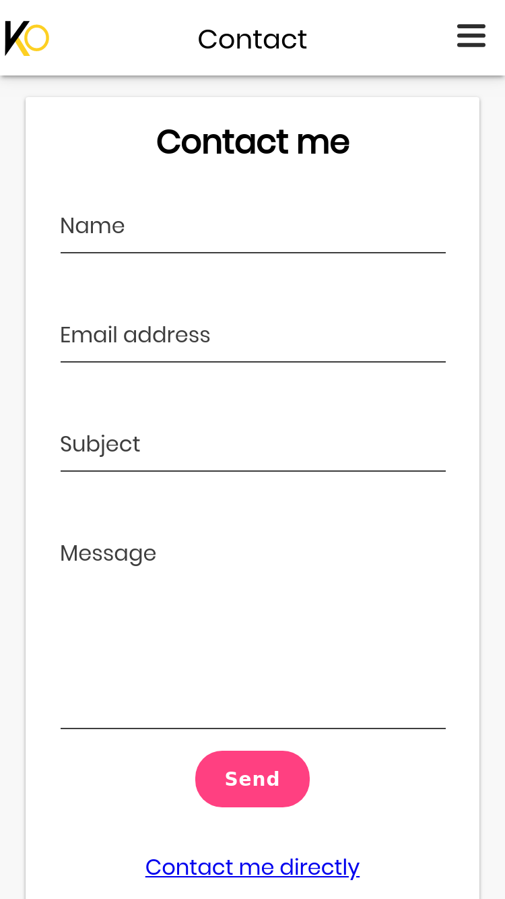

[](https://travis-ci.org/Nalhin/Portfolio)
[](https://codecov.io/gh/Nalhin/Portfolio)

# Personal Portfolio

Portfolio website utilizing React server side rendering (Next.js) written in Typescript.
Integrates Github Graphql v4 API to display my github activity (the latest commits, commit count in last month and much more).
Apollo Client was use for cache management and query handling via hooks.
Fully responsive, mobile first design, supports multiple resolutions and browsers.
Next.js includes a custom config - express server with nextI18NextMiddleware (needed for translations to work)
and contact endpoint, which uses sendmail in order to proxy messages to my own email.
Does not use any component library, every component has been written manually.
Emotion theming has been used for better consistency between components.
Implementation of theme interface was based on [System-UI Theme Specification](https://system-ui.com/theme).
Tests with Jest and React Testing Library, custom Theme and I18Next providers in order for components to render properly during testing.

## Showcase











## Technology Stack

* Typescript
* React
* Apollo Client
* GraphQL (Github API queries)
* I18next (React I18next, nextI18next)
* Emotion (and Themes)
* Framer Motion (Animations)
* Express
* Jest
* React Testing Library
* Travis
* Codecov

## Folder structure

* components (Reusable components)
* constants (Constant variables)
* interfaces (Typescript interfaces)
* lib (External libraries like i18n)
* pages (Next.js Routes)
* server (Custom express server)
* styles (Theme and style variables)
* utils (Utility functions)

## Requirements

Install node package manager [npm](https://www.npmjs.com/).
You should be able to run the following commands.

```bash
node --version
npm --version
```

## Installation

```bash
git clone https://github.com/Nalhin/Portfolio
cd Portfolio
npm install
npm run build
```

##  Start

```bash
npm run start
```

## License

This project is licensed under the MIT License - see the [LICENSE.md](LICENSE.md) file for details.
